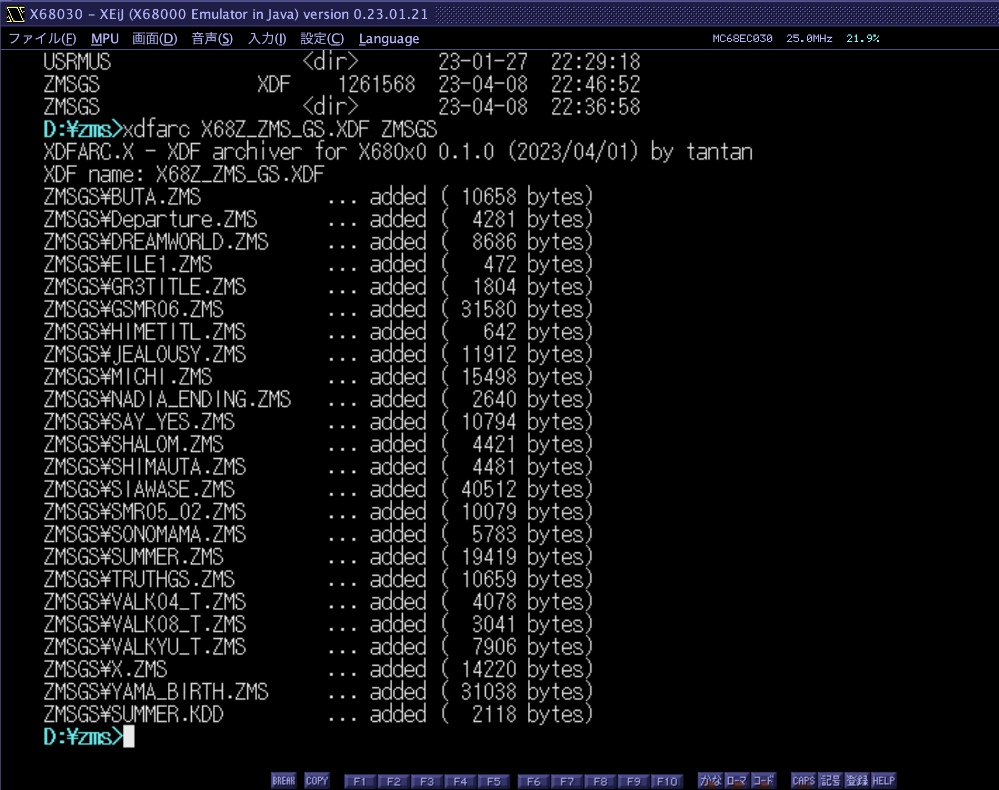

# XDFARC.X

XDF file archiver for X680x0/Human68k

Human68k上のファイル・ディレクトリを再帰的に直接XDFファイルにアーカイブするプログラムです。

tar や lha のような感覚で使えます。フロッピーディスクドライブは使いません。

1枚のXDFに収まらない場合は自動的に複数のXDFを作成することもできます。

注意:
- 1248256バイトを超えるファイルはスキップします。
- IPLを書き込まないので起動用XDFは作成できません。
- XDFファイルは毎回新規に作成されます。追記はできません。
- マルチピリオドには対応していません。

---

### インストール方法

XDFARxxx.ZIP をダウンロードして展開し、XDFARC.X をパスの通ったディレクトリに置きます。

---

### 使用方法

        xdfarc [オプション] <XDFファイル名> [ファイルまたはディレクトリ(ワイルドカード使用可)]

          -f ... 出力先XDFファイルが既に存在する場合、確認無しに上書きします。
          -m ... 1枚のXDFに収まらなかった場合、自動的に2枚目以降のXDFを作成します。
          -l ... 指定したXDFの中身を表示します。(read-only)
          -h ... ヘルプメッセージを表示します。

2番目の引数を省略した場合はカレントディレクトリを指定したものとみなされます。

`-m` を指定した場合、2枚目以降のファイル名は主ファイル名の後ろに数字が付きます。
主ファイル名の長さに余裕を持たせた上、TwentyOneの併用をお勧めします。

動作中は[ESC]キーを押すことでキャンセル可能です。

---

### 変更履歴

* 0.3.0 (2023/04/11) ... -l リストオプション追加
* 0.2.2 (2023/04/11) ... 1.2M近辺のファイルサイズでdisk fullを繰り返すケースがあったのを修正
* 0.2.1 (2023/04/10) ... 0バイトのファイルがあった時にXDF内部のFATが破損していたのを修正
* 0.2.0 (2023/04/09) ... 初版

---

### その他のXDF関連プログラム

- [XDFWRITE.X](https://github.com/tantanGH/xdfwrite) ... XDFを実FDに書き込む
- [DIM2XDF.X](https://github.com/tantanGH/dim2xdf) ... DIMをXDFに変換する

---

### その他のファイル転送関連プログラム

- [RSRX.X](https://github.com/tantanGH/rsrx) ... RS232C(UART)経由でファイル受信
- [RSTX.X](https://github.com/tantanGH/rstx) ... RS232C(UART)経由でファイル送信

